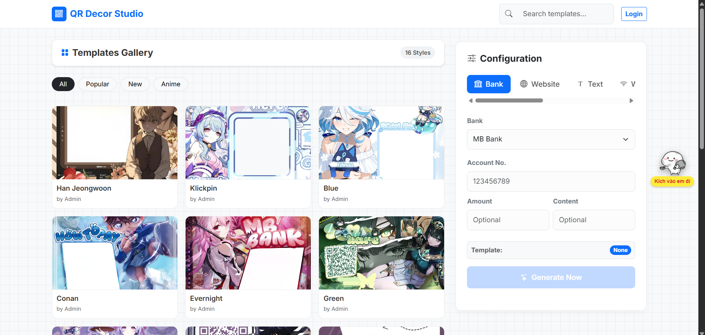

# QR Decor Studio (Qranime)



**QR Decor Studio** là một ứng dụng web cho phép người dùng tạo các mã QR Code nghệ thuật đẹp mắt, đặc biệt là các mã **VietQR** (mã chuyển khoản ngân hàng Việt Nam) được lồng ghép vào các hình nền Anime, Decor độc đáo.

## ✨ Tính năng nổi bật

- 🎨 **Kho Template Đa Dạng**: Hàng loạt mẫu template Anime, phong cảnh và nghệ thuật được thiết kế sẵn.
- 🏦 **Hỗ trợ VietQR**: Tích hợp sẵn danh sách các ngân hàng Việt Nam (MB Bank, Vietcombank, Techcombank, v.v.) để tạo mã chuyển khoản nhanh chóng.
- 🛠 **Đa năng**: Ngoài VietQR, công cụ còn hỗ trợ tạo QR cho:
  - 🌐 Website URL
  - 📝 Văn bản (Text)
  - 📶 Wifi (tự động kết nối)
  - 📞 Số điện thoại & Tin nhắn SMS
  - 📧 Email
- 🖼 **Xử lý hình ảnh nâng cao**:
  - Tự động phối màu QR theo template.
  - Hỗ trợ **Warping** (biến đổi phối cảnh) để mã QR nằm tự nhiên trên các bề mặt nghiêng trong hình nền.
  - Chèn thông tin tài khoản (Tên, Số tài khoản) trực tiếp lên ảnh.

## 🚀 Cài đặt và Sử dụng

Dự án được xây dựng bằng **PHP thuần** (Native PHP) nên rất dễ dàng triển khai.

### Yêu cầu hệ thống

- PHP 7.4 trở lên.
- Extension `gd` (thư viện xử lý ảnh) phải được bật trong `php.ini`.

### Hướng dẫn cài đặt

1. **Clone dự án**:
   ```bash
   git clone https://github.com/trongthaohub/qranime.git
   ```
2. **Triển khai**:
   - Copy thư mục dự án vào thư mục gốc của Web Server (ví dụ: `htdocs` của XAMPP, `www` của Laragon).
3. **Chạy ứng dụng**:
   - Mở trình duyệt và truy cập: `http://localhost/qranime`

## 📂 Cấu trúc dự án

```
qranime/
├── admin/                  # Các class xử lý cốt lõi (Core rendering)
│   └── TemplateRenderer.php # Xử lý render ảnh chung
├── assets/                 # Tài nguyên tĩnh (CSS, JS, Images)
├── font/                   # Font chữ sử dụng để chèn text lên ảnh
├── template/               # Kho giao diện (Mỗi thư mục là một mẫu)
│   ├── pink2/              # Ví dụ một mẫu template
│   │   ├── index.php       # Logic xử lý riêng (ví dụ: coordinates, warping)
│   │   └── bg.jpg          # Hình nền của mẫu
│   └── ...
├── api/                    # Các API endpoint (nếu có)
├── qr-bank/                # Các thành phần liên quan đến VietQR
├── index.php               # Trang chủ và giao diện chính
└── README.md
```

## 🛠 Công nghệ sử dụng

- **Frontend**:
  - HTML5, CSS3, JavaScript.
  - [Bootstrap 5](https://getbootstrap.com/) - Framework giao diện.
  - [QRCode.js](https://davidshimjs.github.io/qrcodejs/) - Tạo QR Code phía client.
- **Backend**:
  - PHP (Vanilla).
  - thư viện **GD** - Để xử lý đồ họa, ghép QR vào ảnh, xử lý màu sắc và biến dạng hình học (Image Warping).

## 📝 Cách thêm Template mới

1. Tạo thư mục mới trong `template/` (ví dụ: `template/new-style`).
2. Thêm file hình nền `bg.jpg` vào thư mục đó.
3. (Tùy chọn) Tạo file `index.php` trong thư mục template để định nghĩa tọa độ chèn QR (`coords`) và màu sắc (`targetHex`) nếu cần xử lý phối cảnh phức tạp. Tham khảo cấu trúc trong `template/pink2/index.php`.

## 🤝 Đóng góp

Mọi đóng góp đều được hoan nghênh! Hãy gửi Pull Request hoặc tạo Issue nếu bạn phát hiện lỗi hoặc muốn đề xuất tính năng mới.

## 📄 Bản quyền

Dự án thuộc về **TrongThao Official**.
